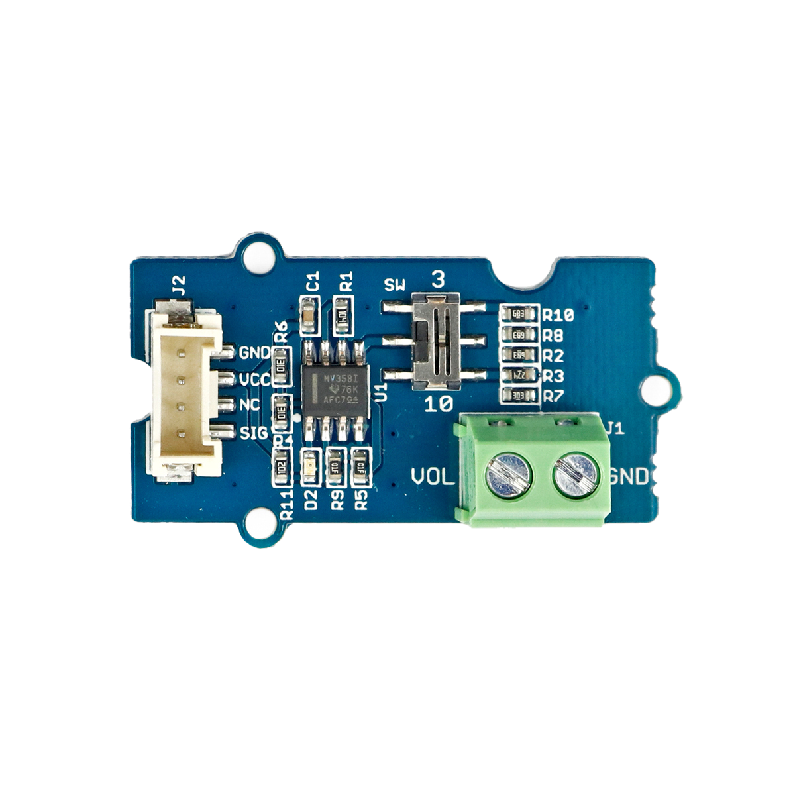

# Spannungsteiler

## Beschreibung
Der Spannungsteiler ermöglicht es, große Spannungen zu verkleinern, um sie beispielsweise für einen Mikrocontroller messbar zu machen. So können Spannungen erfasst werden, die in ihrer ursprünglichen Form zu groß für die direkte Erfassung mit einem Mikrocontroller sind.

Das Modul wird dafür ausgangsseitig direkt oder mithilfe des Grove Shields an einen Arduino oder Raspberry Pi an einen analogen Pin angeschlossen. Eingangsseitig wird die zu messende Spannung angeschlossen.

Auf der Platine können schließlich zwei verschiedene Verstärkungsfaktoren ausgewählt werden: 3 oder 10. Die Ausgangsspannung wird folgendermaßen berechnet:

 

 

Mit dem Spannungsteiler kann z.B. der ungefähre Füllstand eines Li-Po-Akkus ermittelt werden. Ein Li-Po-Akku besteht normalerweise aus vielen einzelnen Zellen, die jeweils eine Nennspannung von 3.7V besitzen. Daher gibt es Li-Po-Akkus mit 3.7V, 7.4V, 11.1V, 14.8V, 18.5V etc. Jede einzelne Li-Po-Zelle eines Akkus hat im vollgeladenen Zustand eine Spannung von ca. 4.2V. Eine Li-Po-Zelle eines Akkus sollte nicht unter 3.4V fallen. Über die Spannungsmessung kann schließlich der Füllstand grob ermittelt werden.

ACHTUNG: Hiermit können keine Spannungsquellen oder Stromversorgungen umgewandelt werden. Es dient lediglich der Messung oder Erfassung von Spannungen.

Alle weiteren Hintergrundinformationen sowie ein Beispielaufbau und alle notwendigen Programmbibliotheken sind auf dem offiziellen Wiki (bisher nur in englischer Sprache) von Seeed Studio zusammengefasst. Zusätzlich findet man über alle gängigen Suchmaschinen meist nur mit der Eingabe der genauen Komponentenbezeichnung entsprechende Projektbeispiele und Tutorials.

 

## Beispiele

!!!show-examples:./examples/

<!-- infolist -->

## Wichtige Links für die ersten Schritte:

- [Seeed Studio Wiki](http://wiki.seeedstudio.com/Grove-Voltage_Divider/) [- Spannungsteiler](http://wiki.seeedstudio.com/Grove-Voltage_Divider/)

## Weiterführende Hintergrundinformationen:

- [Lithium Polymer Akkumulatoren - Wikipedia Artikel](https://de.wikipedia.org/wiki/Lithium-Polymer-Akkumulator)

